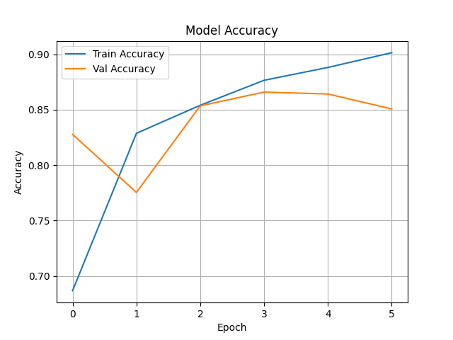
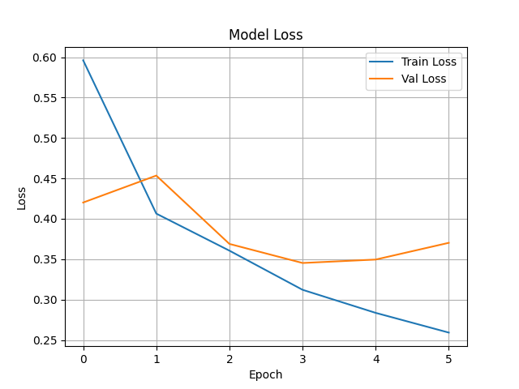
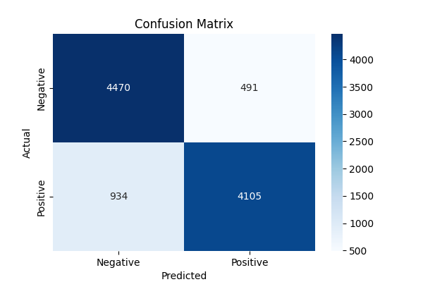

# 🎬 IMDB Sentiment Analyzer using Bidirectional LSTM

This project implements a sentiment analysis model using Bidirectional LSTM on the IMDB 50K movie review dataset. It classifies reviews as **positive** or **negative**, serving as a core component for a larger movie recommendation system.

---

## 🔑 Key Features

- ✅ IMDB 50K dataset support (positive/negative reviews)
- ✅ Bidirectional LSTM architecture for deeper context understanding
- ✅ Tokenization and sequence padding with Keras
- ✅ Evaluation via Accuracy, Loss, Classification Report & Confusion Matrix
- ✅ Pre-trained model ready for deployment or integration
- ✅ Visual plots of training & validation metrics

---

## 🛠️ Tech Stack

- **Python** (3.8+)
- **TensorFlow / Keras**
- **Pandas, NumPy**
- **Matplotlib, Seaborn**
- **Scikit-learn**
- **Google Colab** (for training and visualization)
- **Jupyter Notebook (.ipynb)**

---

## 📊 Model Performance

| Metric              | Value     |
|---------------------|-----------|
| Train Accuracy       | ~90%      |
| Validation Accuracy  | ~88–89%   |
| Loss                | Binary Crossentropy (from_logits=True) |
| Optimizer           | Adam      |

---

## 📈 Visualizations

### 🔹 Accuracy and Loss Curves

  


### 🔹 Confusion Matrix



---

## 🚀 Installation & Usage

### 🔧 Clone the repository
```bash
git clone https://github.com/<your-username>/imdb-sentiment-analyzer.git
cd imdb-sentiment-analyzer
